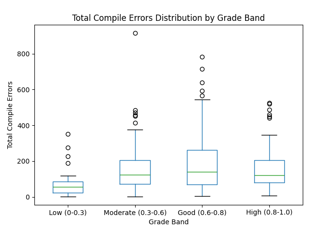

# Education Data Mining

## Setup

1. Clone the repository

```bash
git clone https://github.com/daiwik-swaminathan/EducationDataMining.git
```

2. Install the dependencies

```bash
pip install -r requirements.txt
```

3. Run the code

```bash
python predictions.py
```

## Data

The data is stored in the `Data` folder.


# **Task 2: Predicting Final Exam Scores Using Programming Submission Data**

## **Overview**
This project aims to predict students' final exam scores using regression models trained on programming submission data. The dataset includes programming attempts, compiler errors, timestamps, and final grades. By analyzing these patterns, we aim to provide insights into student learning patterns to help educators identify students who may need additional support.


---

## **Setup & Installation**
To run the model and analyze the data, follow these steps:

### **1. Clone the Repository**
If not already downloaded, clone the repository:
```bash
git clone https://github.com/daiwik-swaminathan/EducationDataMining.git
```

2. Install the dependencies

```bash
pip install -r requirements.txt
```
## **Run the code**
To execute the model, simply run the following command:

```bash
python creatingModel.py
```

## **Generated Visualizations**
After running `creatingModel.py`, these images will be displayed

### **1. Actual vs. Predicted Scores**
This plot shows how well the model's predicted scores align with actual student exam scores.


---

### **2. Correlation Matrix**
This heatmap displays the relationships between different features used in the model.


---

### **3. Early vs. Final Performance**
This graph compares early programming performance (e.g., first few submissions) with final grades.


---

### **4. Feature Importance**
This chart highlights which features had the most impact on the model's predictions.


---

### **5. Total Compile Errors**
This visualization shows the distribution of total compile errors among students.




